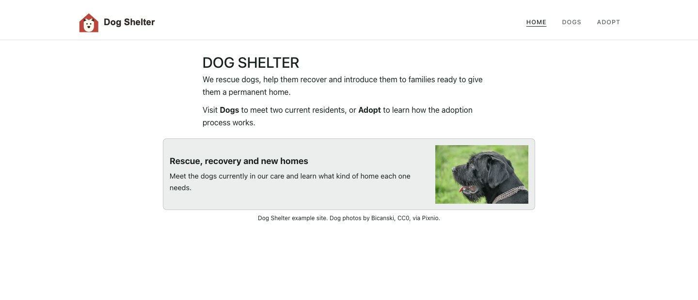

# Norna

**Build responsive websites from Markdown, images, and a theme preset.**

Norna is an opinionated, open source CLI for building websites from plain
files. You write the content, keep images beside the content they belong to,
and choose a visual preset. Norna provides the page structure, navigation,
responsive image output, validation, and static build.

The result stays readable as source files and works naturally with Git and
AI-assisted editing. Norna deliberately offers fewer architectural choices
than a general-purpose site generator: you describe the site instead of
implementing a new presentation layer for every project.

[Documentation](https://janga.github.io/norna/) |
[Five-minute tutorial](docs/getting-started.md) |
[Live examples](https://janga.github.io/norna/examples/) |
[npm package](https://www.npmjs.com/package/@janga/norna)

[](https://janga.github.io/norna/examples/complete-sites/dog-shelter-multi-page/)

The screenshot shows the built
[multi-page example source](examples/complete-sites/dog-shelter-multi-page/).

## Quick Start

You need Node.js 22.12 or later.

```sh
npx @janga/norna@latest init my-site
cd my-site
npm install
npm run norna:dev
```

Open the URL printed by the development server, then edit the files under
`site/`. The generated project pins its Norna version and includes the npm
scripts and GitHub Pages workflow needed to check, build, and publish it.

Follow the [five-minute tutorial](docs/getting-started.md) for a first edit and
verified build.

For shorter commands, install the launcher globally with
`npm install --global @janga/norna@latest`. You can then use `norna dev`,
`norna check`, and `norna build`; inside a project, the launcher selects its
locally installed and pinned Norna version.

## The Site Model

```text
site/
|-- config.yaml
|-- theme.yaml
|-- sitewide-content.yaml
|-- content.md
|-- images/
|-- routes/
`-- public/
```

- `content.md` holds the homepage and its sections.
- `images/` holds managed source images beside the content they belong to.
- `routes/` adds pages, each with content and optional local images and theme.
- `theme.yaml` normally selects one complete visual preset.
- `sitewide-content.yaml` holds shared logo display settings, banners, and footer content.
- `config.yaml` holds the public URL and optional language and scroll behavior.
- `public/` holds static files copied without processing.

Norna validates this structure, processes managed images when needed, and
builds the generated website into `dist/`.

## Why Norna?

- **Useful defaults instead of a new layout project.** Presets coordinate
  typography, spacing, palettes, image sizing, and section surfaces.
- **Images without the repetitive work.** Norna creates responsive variants,
  selects suitable browser sources, and reuses unchanged generated output.
- **Files that remain manageable.** Content and assets can be inspected,
  reviewed, versioned, and edited with the tools you already use.
- **A complete publishing path.** The starter includes validation, static
  builds, and an integrated GitHub Pages workflow.

## Examples

Every example is built in the repository test suite and published with the
documentation.

| Example | Live site | Source |
| --- | --- | --- |
| Dog shelter, single page | [Open demo](https://janga.github.io/norna/examples/complete-sites/dog-shelter-single-page/) | [View files](examples/complete-sites/dog-shelter-single-page/) |
| Dog shelter, multi-page | [Open demo](https://janga.github.io/norna/examples/complete-sites/dog-shelter-multi-page/) | [View files](examples/complete-sites/dog-shelter-multi-page/) |
| Theme presets | [Open demo](https://janga.github.io/norna/examples/feature-demos/theme-presets/) | [View files](examples/feature-demos/theme-presets/) |
| Media and surfaces | [Open demo](https://janga.github.io/norna/examples/feature-demos/media-and-surfaces/) | [View files](examples/feature-demos/media-and-surfaces/) |
| Sitewide content | [Open demo](https://janga.github.io/norna/examples/feature-demos/sitewide-content/) | [View files](examples/feature-demos/sitewide-content/) |

See [examples/README.md](examples/README.md) for what each example is intended
to demonstrate and how to run it locally.

## Is Norna A Good Fit?

Norna is designed for sites that should be straightforward to edit, review,
and publish without creating a custom presentation architecture. Typical uses
include project and product sites, documentation, portfolios, personal sites,
and organisation or information sites.

Norna is not intended for dynamic applications, database-backed publishing,
visual CMS workflows, or projects that need complete control over templates,
components, and rendering logic.

## Requirements And Current Limits

- Node.js `>=22.12.0` is required.
- ImageMagick is required when Norna generates responsive raster image variants.
- GitHub Pages is the only publishing provider integrated by Norna today.
- The build output is static and written to `dist/`; other static hosts can
  serve that output, but Norna does not currently configure or publish to them.
- Norna is pre-1.0 software. Its file model and CLI may still change between
  releases.

GitHub CLI and Playwright are needed only for specific deploy helpers and
engine diagnostics, not for ordinary editing and local preview. See
[Requirements and limitations](docs/requirements.md) for the exact boundaries.

## Documentation

- [Five-minute tutorial](docs/getting-started.md)
- [Site files](docs/site-files.md)
- [Task-oriented documentation map](docs/README.md)
- [Common workflows](docs/README.md#common-workflows)
- [Concepts and explanation](docs/README.md#concepts-and-explanation)
- [Command and platform reference](docs/README.md#command-and-platform-reference)
- [Troubleshooting](docs/README.md#troubleshooting)
- [AI-readable documentation index](https://janga.github.io/norna/llms.txt)

Engine contributors should start with
[Engine Development](docs/engine-development.md). Planning and future work are
tracked in [BACKLOG.md](BACKLOG.md).

## Support And License

Use the [issue tracker](https://github.com/janga/norna/issues) for reproducible
bugs, documentation problems, and focused feature proposals.

Norna is licensed under [GNU GPL v3](LICENSE).
