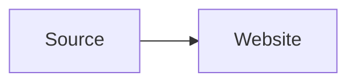

# BL-051: Technical Diagram Sources

## Outcome

Decide whether frequently edited technical diagrams should be rendered from
text source by Norna or remain externally generated managed SVG images.

## Evidence

Docusaurus and Material for MkDocs offer Mermaid integrations. Norna can
already publish a pre-rendered SVG through its managed image model, which is a
good information-preserving migration path. Native source rendering adds value
only when maintainers need to edit diagrams often enough to justify another
build dependency and content syntax.

## Syntax Status: Conditional

No new syntax is justified while managed SVG remains the recommended path. If
the evidence supports native Mermaid rendering, reuse the established fenced
language form documented by
[Docusaurus](https://docusaurus.io/docs/markdown-features/diagrams) and
[Material for MkDocs](https://squidfunk.github.io/mkdocs-material/reference/diagrams/):

````md

````

Do not introduce `norna-diagram`. A design is still required for an accessible
description, appearance-aware output, and the checked-in source or provenance
needed to regenerate the SVG.

## Evidence Required

- Collect at least two maintained Norna sites whose diagram source changes as
  part of normal documentation work.
- Compare checked-in generated SVG, build-time Mermaid rendering, and an
  external diagram-generation command.
- Measure dependency and package impact, deterministic output, build time, and
  dark/light appearance behavior.
- Define how alt text, a longer text description, source provenance, and
  fallback output remain available to assistive technology.
- Confirm that the implementation adds no diagram runtime to ordinary pages.

## Acceptance Criteria For Decision

- The recommendation names the user workflow that static managed SVG cannot
  serve adequately.
- Any native proposal owns one closed source syntax and renderer rather than a
  general diagram plugin API.
- Generated output is deterministic, cacheable, and compatible with the
  existing image manifest and source-location rules.
- If evidence remains weak, retain external generation as the documented
  migration strategy and close this item without product code.
