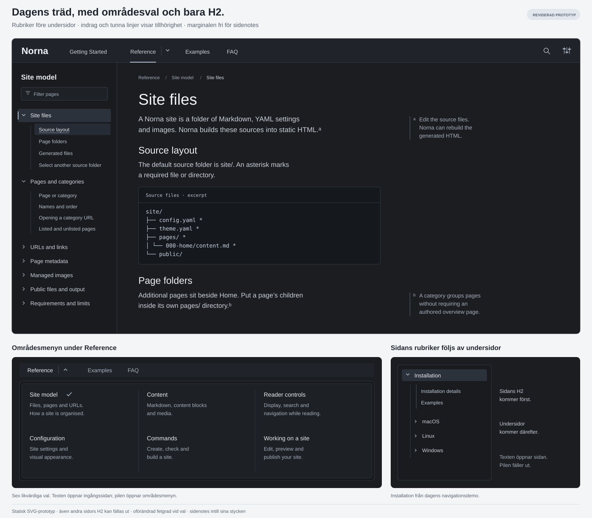

# BL-122 Area navigation and integrated H2 prototype

## Purpose

Give documentation readers more room for the article and its sidenotes by
choosing an area from the site's navigation and showing that area's pages and
H2 headings in one left menu. Evaluate the complete reading experience before
changing Norna's supported navigation model.

**Completed as an opt-in prototype on 2026-09-19.** The implementation follows
the user's interactive review, with updated browser coverage, installed-browser
measurements and an isolated build. Final verification also corrected a WebKit
history-entry race. The recommendation is to adopt the reviewed design in the
separate adoption step below, settling category descriptions and the supported
reference contract together. The prototype remains off by default.

[BL-129 Regression tests for the navigation latency correction](BL-129-navigation-latency-regression-tests.md)
completed in `11e63c7` before this implementation. The
[working-prototype record](../area-navigation-prototype.md) contains start
instructions, implementation boundaries and verification status. This develops the existing **BL-122
Reconsider the right-hand menu**, originally recorded without analysis because
the right contents rail competed with sidenotes. It is the same product
outcome, not a second backlog item.

The user approved the revised static prototype on 2026-09-19. That approval
establishes the visual direction below; it does not establish that a working
implementation, responsive behavior or browser interaction has been tested.

## Scope and boundaries

Build an explicitly enabled, local prototype on a physical copy of the
documentation site under `.local/test-sites/scratch/site/`, using the registered
`scratch` review target. Keep the ordinary documentation site available as a
baseline. Begin with Reference, whose six sibling areas supply the approved
example; also exercise Getting Started, FAQ and Examples when moving between
global destinations.

Keep page URLs, content ownership and the existing page/category hierarchy.
An area is a navigation scope, not a new authored page type. Existing category
destinations continue to work; do not add editorial landing pages merely to
populate a menu. Include a fixture with a content-bearing parent page, its own
H2 headings and child pages, plus a deeper nested branch.

This item delivers a reviewable prototype, evidence and a recommendation about
adoption. Keep it opt-in and independently comparable with the existing
navigation-continuity prototype. Do not enable it by default, release it, add
a supported configuration contract or change all sites' navigation modes in
this item. A later adoption decision must settle the public contract and its
reference documentation.

## Decisions made

### Sticky navigation and area choice

- Keep the global sticky row on Home and outside the desktop tree reading
  frame. On desktop tree pages, use one sticky row: Home, site search and
  Display above the left tree; an icon menu button and breadcrumbs above the
  article. Do not add a second collection-selector row above the tree. The
  button's accessible name identifies the global collection, such as Reference.
  Its panel reuses the global menu's area layout and adds a separate footer of
  Home and other global destinations. Keep the breadcrumb's existing links
  independent of the menu button. Put Site model or
  another distinct local area title above the tree as ordinary text, without
  a link, chevron or hover treatment. Do not repeat identical collection and
  area titles. Keep a compact control row on mobile and in Focus reading;
  Display must remain available to turn Focus reading off. Search retains its
  full-site content scope; the tree filter retains its label-filtering scope.
  Choose the frame by navigation mode, independently of the presence of H2.
  This supersedes both the earlier Home-to-tree global-header rule and the
  two-row left-header trial following the user's 2026-09-19 review. Compact
  layouts retain in-article breadcrumbs; do not show a duplicate trail.
- In the global sticky row, align direct links and menu titles on the same
  text baseline. A title with a menu
  opens on hover without a visible disclosure arrow. Retain keyboard, touch
  and no-script activation. Escape must dismiss a hover-opened panel without
  first moving focus into it. Crossing or pausing between title and panel must
  keep it open, including a diagonal route to the first choice.
- Give a global menu title a restrained frame and background on hover and
  keyboard focus, and keep that treatment while its panel is open. The
  treatment must not change label positions or dimensions. Menu titles open
  panels and have no link underline. Reserve hover underlining for available
  destination links; do not suggest that an unavailable link can be followed.
- Put links to categories and content-bearing parents in a described group;
  put direct page links in a separate group. An entirely flat collection uses
  a horizontal panel of plain links in balanced columns; a compact list is used
  only beside parent choices. Keep panels beneath their title's area and within
  the available width, including after resizing. An authored root page is
  first in the parent group and opens its own page and tree. Destinations
  without children remain direct sticky links. These refinements follow the
  user's 2026-09-19 review of the working trial.
- For more than twelve visible choices, including an authored root's own
  choice, make the sticky title a direct link to the existing destination and
  retain the full collection tree on its pages. Count after excluding unlisted
  nodes. Twelve is the delegated prototype decision, not a public setting or
  an established standard. Bound the panel height at the viewport for long
  labels and descriptions even below that threshold.
- Use the approved Linear-inspired three-column area menu on wide screens.
  All six Reference areas have equal visual status: the same title treatment,
  description space and interaction. Do not make the last two secondary links.
  Use the existing node titles: Site model, Configuration, Content syntax,
  Commands, Reader experience and Working on a site. The sketch's shorter
  `Content` and `Reader controls` labels do not authorize renaming content.
- Choosing an area scopes the left menu to that branch. Keep all other areas
  reachable through the collection menu. A direct URL, prose link or history
  navigation must resolve the same area as arrival through the menu.
- Preserve the area's own destination and any useful parent content. Opening
  a disclosure must not follow its link, and following a link must not toggle
  the disclosure instead.

### Left menu

- Show the selected area's pages and categories rather than repeating the
  complete Reference tree. Preserve hierarchy inside the selected area.
- Keep a flat collection together: when its listed direct children have no
  child pages, show all sibling pages and their H2 in one left tree. Apply this
  to categories and authored parents, without a minimum page or heading count.
  FAQ and Getting Started keep their direct sticky choices while sharing a
  left tree within each collection. This supersedes their own-H2-only rule
  following the user's 2026-09-19 review.
- In a collection with subgroups, a direct leaf beside those groups has only
  its own H2, as does a standalone global page. Omit that rail if there is no
  H2. A parent destination shows its own tree, and a leaf inside an area
  retains the area's tree. Large collections retain their full tree on every
  page. Scope follows hierarchy and the overflow rule, not arrival route.
- Show H2 links beneath their owning page. H3 headings remain in the document
  with their existing anchors but do not add another menu level in this trial.
- Keep the current implementation's order for a page with both an outline and
  children: its H2 links first, then its child pages, under the same parent
  disclosure. Use restrained indentation, spacing and a thin vertical line
  to convey belonging. Add no visible `On this page` or `Child pages` labels.
- Other pages' H2 links can be disclosed without first loading those pages.
  Preserve independent branch choices; opening one branch does not close
  another.
- A new page choice opens the destination's branch, its H2 and the ancestors
  needed to reach it. Apply this to sticky choices, left-menu links and other
  internal page links, even when that destination was previously closed.
  Clicking the current page's name returns to its beginning and opens its
  branch; clicking an H2 follows the fragment and keeps its owner open.
- Back/Forward restores that history entry's disclosure state, menu position
  and article reading position. It must not apply the new-page opening rule.
  Preserve unrelated open/closed branches. A chevron alone toggles without
  navigating; repeated page-name clicks must not close the branch.
- Prepare the arriving tree before its first visible frame. Do not expand
  the departing tree immediately before a page change. Preserve the clicked
  left-menu row's position, including low rows and the first clicks after a
  sticky choice; later heading tracking must not move it on arrival. Rows below
  an opened branch may move to make room for its contents. Assess opening and
  blink/jump stability together in Safari, Chrome, Firefox and Brave.
  A direct arrival in a short viewport must reveal the selected page name
  before display when no saved scrolled/history position needs preserving.
- Page text is a real page link; an H2 entry is a real fragment link; the
  separate chevron opens or closes a branch. Navigation without JavaScript,
  opening links in a new tab, deep links and normal browser history remain
  available.
- Keep navigation label size and weight constant when current-page and
  current-heading state changes. Current-page and reading-position markers
  must not change line wrapping or move following rows.

### Reading surface and sidenotes

- Remove the persistent right contents rail from the prototype's reading
  layout and reclaim its column and gap. Keep the article's prose measure
  readable; use the additional room for the content canvas and sidenotes.
- Keep sidenotes beside the paragraphs they explain, using Norna's small
  reference letters and restrained margin treatment. They are not a separate
  fixed panel or another navigation column.
- Preserve the existing flow fallback when a note lane does not fit, reader
  Display choices and Focus reading. At narrow widths, retain the compact
  navigation and access to every page and H2 destination represented by the
  prototype, without horizontal page overflow.

## Approved visual reference

This is the revised SVG approved on 2026-09-19, authored as a vector concept
during the design discussion. It is not a capture of implemented UI. The main
view uses Site files; Pages and categories is also expanded to demonstrate
access to another page's H2 links. The parent-page detail uses Installation
from `fixtures/nested-pages/site`, matching the order observed in the current
implementation. Article excerpts and notes illustrate the layout.

The reference menu borrows the broad structure observed in
[Linear's Resources menu](https://linear.app/), with equal treatment of all six
Norna areas as the user's explicit adaptation. Linear's inspected
[documentation page](https://linear.app/docs/update-cycles) keeps its article
outline on the right; integrating H2 on the left is a Norna design choice.
The left tree's separate link/disclosure behavior follows the
[W3C WAI navigation example](https://www.w3.org/WAI/ARIA/apg/patterns/disclosure/examples/disclosure-navigation-hybrid/).
These references support the pattern, not a claim that every dimension or
interaction in the SVG is an established standard.

## Existing-code findings and implementation baseline

On 2026-09-19 the user requested examination of the existing code rather than
deciding between automatic and author-selected areas as a new product choice.
That inspection establishes the following foundation:

- [The shared tree builder](../../../scripts/lib/site-navigation-tree.mjs)
  builds parent/child relationships from `parentPagePath`, retains source
  ordering, filters unlisted subtrees and omits empty categories.
- [SiteNavigation](../../../src/components/SiteNavigation.astro) uses that
  tree's roots for the sticky destinations.
  [SiteTreeNavigation](../../../src/components/SiteTreeNavigation.astro)
  selects the root containing the current page and renders its whole branch.
  Thus Reference is today's local root, with Site model and Configuration
  already represented as its immediate children.
- [TopPageMenu](../../../src/components/TopPageMenu.astro) already separates
  the title link from a disclosure and can receive a node's children. The
  present tree-mode page does not enable that top child menu; showing area
  choices there and selecting a deeper local root are new prototype behavior.
- [NavigationPageTree](../../../src/components/NavigationPageTree.astro)
  already places a parent's heading outline before its children and permits
  disclosure of other pages' headings. Reuse that ordering and link semantics.
- [The schemas](../../../scripts/lib/schema-definitions.mjs) provide
  `navigation.mode` and page listing metadata, but no author-selected area
  boundaries. A category has only `label`; unlike a content page, it has no
  description field.

Use the existing tree as the automatic source for this opt-in trial. Area
choices are the listed immediate children of a sticky destination, preceded by
its own authored page when present. A child with descendants establishes that
branch as the local root; a child without descendants remains a direct page
destination. A flat FAQ or Getting Started collection uses the sticky menu for
page choices and retains all its siblings and their H2 in the left tree. A
deeper arrival selects the same immediate child branch from ancestry, not from
a remembered click. At a parent's own page, retain its own H2 followed by its
child pages.
When the top menu would exceed twelve visible choices, its existing
destination and descendants retain the full collection tree. Keep the shared
category destination: a category may already open its first child rather than
a generated overview. Do not introduce a new redirect or landing page.
Home keeps its existing exception.

These rules are an implementation baseline derived from the existing model
and the approved Reference sketch, not a claim that the new scoped behavior
already exists. Do not add author-maintained area metadata, hardcode the six
Reference labels into engine logic, change URLs or reparent content. Derive
state keys and selected-area markers from stable node identity; preserve the
shared category-destination resolver and filtering rules.

For the six category descriptions in the visual trial, use explicitly scoped
preview copy outside the public category schema. Page descriptions may come
from existing metadata. Include missing-description cases, keep equal area
status, and do not silently infer descriptions or introduce a new public
field. The descriptions' permanent source belongs to the adoption decision.

## Preliminary proposals

Keep responsive arrangement, submenu placement and exact spacing as prototype
work. The three-column drawing establishes the desktop direction, not fixed
pixel dimensions for every viewport. Reuse the existing compact menu and
disclosure semantics wherever they cover the contract.

## Open questions

None blocks the bounded prototype. The existing code supplies its tree and
area-selection baseline; the approved SVG supplies its visual direction.
Default rollout, whether author overrides are justified, the permanent source
of category descriptions and changes outside this trial belong to the later
adoption decision. Do not treat a preselected question option as user approval.

## Dependencies

- Complete and commit
  [BL-129 Regression tests for the navigation latency correction](BL-129-navigation-latency-regression-tests.md)
  before changing the navigation again. Use that result as the regression
  baseline instead of rerunning the same unchanged checks for this brief.
- Preserve the approved behavior and fixes recorded in
  [BL-120 Smooth documentation navigation prototype](BL-120-smooth-documentation-navigation-prototype.md)
  and the subsequent [navigation latency investigation](../navigation-latency-investigation.md).
  In particular, retain stable menu typography, restored scroll state and the
  Safari correction that avoids a separate article snapshot.
- Keep the completed
  [BL-123 Navigation JavaScript refactoring assessment](BL-123-navigation-javascript-refactoring-assessment.md)
  and its focused refactorings as the starting point. This item is not a new
  general JavaScript cleanup project.
- [BL-119 Direct-hash positioning in static previews](BL-119-static-preview-hash-positioning.md)
  is a separately tracked baseline issue. Record its effect on this trial
  explicitly; do not weaken fragment-position assertions or imply it is fixed.

## Implementation prerequisites

Implementation began after **BL-129 Regression tests for the navigation
latency correction** completed and was committed. The code-derived baseline,
approved SVG and subsequent sticky/flat-page decisions are durable inputs;
repeating their design approval is unnecessary. Review the working result next.

## Prototype review and acceptance

Implement a coherent local trial, inspect its rendered desktop, intermediate
and mobile states in light and dark Appearance, and then give the user the
registered review URL. Human review of the working behavior precedes broad
browser regression work. Static sketch approval does not replace this review.

Use the following cases to assess the change and record observations separately
from hypotheses:

| Case | Required result |
| --- | --- |
| Select each Reference area; open its page directly or through a prose link. | The same area is selected and all its pages remain reachable; other areas remain available from the sticky menu. |
| A flat collection, mixed parent/direct choices, an authored global parent and an unlisted subtree. | Parent links and direct page links occupy separate groups. Flat collections share their full page/H2 tree on direct and menu arrival. A leaf beside subgroups has only its own H2; parent destinations retain a tree. Excluded nodes stay excluded. |
| Hover a sticky title, pause in the gap, move diagonally into the panel, then away; dismiss with Escape while article focus remains. Also activate by keyboard and touch, allowing time after the tap. | No visible disclosure arrow or baseline mismatch. The panel stays open during the crossing and after a tap; it remains reachable, dismissible and operable without hover. |
| Open Getting Started and FAQ at wide and intermediate widths; resize with a panel open. | Flat collections use balanced columns. The panel remains beneath its title's area and within the viewport. |
| A collection at twelve choices, one beyond the limit and a large collection with unlisted children. | Twelve choices fit a menu; beyond the limit the sticky title is a link and all collection pages retain its full tree. Unlisted choices do not affect the threshold. |
| Parent page with its own H2 and child pages; deep descendants; a category with no authored page. | H2 precedes child pages, each link has the right destination, and the presentation requires no invented parent content. |
| Disclose another page's outline while reading the current page. | Both can remain open; the other page's fragment links navigate correctly. |
| Close Install Norna, choose it from Getting Started, then click its name in the left menu; repeat with FAQ and with a low Reference row. | The selected branch/H2 opens, repeated name clicks leave it open, other branches retain their choices, and the selected row does not jump. No intermediate closed arriving tree or expanded departing tree is shown. |
| Navigate among pages and H2 links, change disclosure/scroll state, then use Back/Forward with and without a cached document. | Each entry restores its earlier disclosure state and menu/article positions, including a deliberately closed current branch. New-tab and modified clicks retain native behavior. |
| Open and close branches near the top and bottom of a scrolled left menu. | Expansion preserves the activated row's position; collapse permits only the existing adjustment at the scroll limit; the last item has visible breathing room. |
| Switch sticky destinations, then make the first few left-menu clicks; include Examples to Reference. | No initial menu jump, font-weight reflow, appearance flash or renewed page-transition delay. |
| Follow Home to What Norna Does, continue among tree-mode pages and return Home; repeat at intermediate/mobile widths and in Focus reading. | Home uses global navigation; desktop tree pages retain their stable reading frame regardless of H2 count. Home, Search and Display remain reachable; mobile and Focus reading retain a compact Menu. |
| Open Install Norna and Site files, then expand and scroll their trees; include light and dark appearance. | Getting Started is identified in the sticky breadcrumb without an extra label above its tree. Site model remains an unobscured plain label above its filter. Scrolled rows remain masked behind the sticky controls. |
| Scroll the article, follow an H2, and open the icon menu beside the breadcrumb; repeat at intermediate width. | The breadcrumb and button stay in one sticky row. The heading clears that row, the menu remains within the viewport, and there is no duplicate in-article trail. |
| Scroll the article and menu independently, especially Site files and Convert legacy sources in Safari fullscreen. | Scrolling remains responsive, the menu reaches its end and rows stay below its sticky filter controls. |
| Follow current-page H2, another page's H2, existing H3 deep links, category/overview links, prose links and Back/Forward. | Correct destination, anchor offset and history reading-position restoration; ordinary external-link behavior remains intact. |
| Keyboard, touch, no JavaScript, reduced motion, narrow layout and Focus reading. | Links and disclosures retain distinct actions, focus stays usable, supported destinations remain reachable and notes reflow without overlap. |

Check the visual and scroll cases in installed Safari, Chrome, Firefox and
Brave. A Playwright WebKit result does not substitute for installed Safari
evidence. Capture a small representative set through `npm run review:capture`;
record the page, viewport, Appearance and relevant browser when reporting a
result. Reuse existing diagnostic sequences rather than restarting an
unbounded blink investigation.

After the user approves the working result, add or update the focused area
selection and browser regression coverage. Run
`npm run review:test -- navigation` for changed tree/outline/scroll contracts
and `npm run test:navigation` for the separate sticky-navigation contract. Cover the new
opt-in path explicitly so passing baseline checks cannot mask a skipped
prototype. Reuse the existing prototype regressions where applicable; do not
run an aggregate and its covered child commands on unchanged code.

Follow the repository's build and documentation checks for the actual files
changed. Record exact commands, results and intentional verification gaps.
The full release test chain is not required merely to finish this prototype.

Complete the item with a reproducible opt-in trial, approved interaction and
layout evidence, passing focused checks, and a concise recommendation to
adopt, revise or reject the design. Commit this item's implementation as its
own logical change before starting another backlog item. Promotion to the
default product remains a separate decision.
